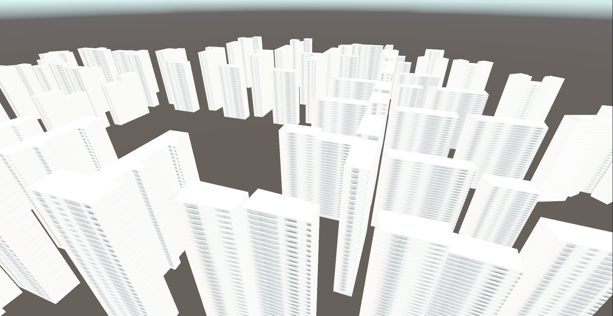

# 문제 해결 방법

(혹시 모르니, 문제 서술 부분은 제거하고 해결 방법만 작성합니다.)

## API Response parsing

문제 풀이를 시작해보자. 일단 API Response가 Base64로 인코딩 된 string이 들어오며, 포맷은 json이다. 좀 더 좋은 구조를 만들어야 한다면 Request, Response 핸들러가 있으면 좋겠지만 굳이 그럴 필요까진 없어보이므로 간단하게 클래스 분리만 한다. `APIResonse.cs` 에서는 json 오브젝트를 서술하며, `ResponseParser.cs` 에서는 API Response를 파싱한다.

옛날 유니티의 JsonUtility는 믿음직하지 못해서 원래는 Json.NET (https://www.newtonsoft.com/json) 을 사용했는데, JsonUtility도 잘 되는 것을 우연찮게 발견해서 다시 JsonUtility를 사용하게 변경했다. 

Base64 Decoding은 아래와 같은 코드를 사용했다.
```C#
var byteArr = System.Convert.FromBase64String(code);
var floatArray = new float[byteArr.Length / 4];
for (var i = 0; i < floatArray.Length; i++)
{
    floatArray[i] = BitConverter.ToSingle(byteArr, i * 4);
}
````

## Assignment 1
`Architect.cs` 가 중점적인 클래스가 되어 로직을 제어한다. 파싱한 정보를 바탕으로 메시와 UV를 설정하는 곳은 `MeshGenerator.cs`에 있는 `MeshGenerator ` 클래스이다. coordinateBase64로 이루어진 코드를 파싱하고, 이를 통해 Vector3로 이루어진 버텍스를 만든다. 버텍스 위치가 중복되어 있는 곳이 있으나, 버텍스 3개당 메시를 이루는 삼각형 하나를 할당하면 깔끔하게 해결할 수 있는 듯.

```C#
foreach (string code in roomType.coordinatesBase64s)
{
    // ...

    for (var i = 0; i < floatArray.Length; i = i + 3)
    {
        var vertice = new Vector3(floatArray[i], floatArray[i + 2], floatArray[i + 1]);
        vertices.Add(vertice);
    }

    for (int start = 0; start < vertices.Count; start += 3)
    {
        triangles.Add(start + 0);
        triangles.Add(start + 1);
        triangles.Add(start + 2);
    }
    
    // ...
}
```
이렇게 만들어진 버텍스와 삼각형들을 새로운 메시에 할당해준다.
```C#
var newMesh = new Mesh();
newMesh.vertices = vertices.ToArray();
newMesh.triangles = triangles.ToArray();
newMesh.RecalculateNormals();
MeshGenerator.AddMesh(newMesh);
```

`MeshGenerator.AddMesh()` 에서는 새로운 게임 오브젝트, 메시 필터, 메시 렌더러를 만들고 구성된 메시를 할당하여 렌더한다.


## Assignment 2
만들어진 아파트 메시에 텍스처 매핑을 해야 한다. 머티리얼 하나를 만들고, 여기에 주어진 이미지 파일을 추가하여 머티리얼을 추가한다.
```C#
 newObject.GetComponent<MeshRenderer>().material = CommonMaterial;
```

버텍스의 노멀들은 `Mesh.normals` 에 있다. `Mesh.RecalculateNormals()` 함수를 호출하여 설정된 버텍스와 삼각형의 노멀들을 갱신해준다. 

`MeshGenerator.FindDirection()` 을 사용하여 현재 버텍스의 노멀을 사용하여 어느 평면의 버텍스인지 결정하고, 이렇게 구해진 평면을 바탕으로 임의의 정점을 통해 텍스처의 uv를 보간으로 구한다.


## 결과물


